<h1>Hi, I'm <strong>Harilal</strong></h1>
<h3>SOC Analyst Intern | Detection Engineering | Threat Detection · SIEM · Incident Response</h3>

I'm a cybersecurity student focused on Blue Team operations, detection engineering, and incident response. I enjoy investigating security events, analyzing malware traffic, writing detection logic, and understanding how attacks work from both offensive and defensive perspectives.

I've completed hands-on work with Splunk, Wazuh, Microsoft Entra ID, HTB Academy, Hack The Box machines, and PortSwigger Web Security Academy. I also build technical documentation, perform malware PCAP analysis, and develop small security tools and labs to strengthen practical skills.

Currently expanding my knowledge in Windows security, Active Directory, Microsoft Sentinel/KQL, web application security, and detection engineering while continuously building projects and documenting everything I learn.

<!-- hero: monochrome ASCII portrait (types in) beside a neofetch-style info
     panel. regenerate portrait: python scripts/prep_photo.py <photo> &&
     python scripts/make_ascii_svg.py ; info panel: python scripts/make_info_card.py -->

<!-- animated contribution graph: real data, boxes reveal cell by cell
     (regenerated daily by .github/workflows/update-profile-art.yml) -->

 
 

<h3><code>hari@github ~ $ whoami</code></h3>

<table>
<tr>
<td valign="top"></td>
<td valign="top"></td>
</tr>
</table>

 
 

<h3><code>hari@github ~ $ ./links.sh</code></h3>

<b>Aspiring SOC Analyst · DFIR · Blue Teamer</b>

 

