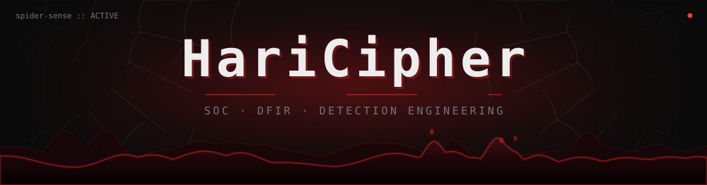
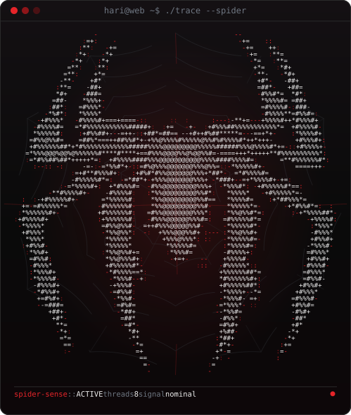
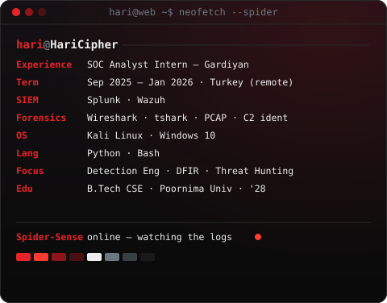

<!--
  Symbiote-black / crimson Spider-Man theme.

  Regenerate the art assets:
    python3 scripts/make_banner.py         -> web-banner.svg    (header: webbing, name, symbiote drip)
    python3 scripts/make_spider_svg.py    -> spider-ascii.svg  (ASCII spider, web-weave animation)
    python3 scripts/make_info_card.py     -> info-card.svg     (neofetch panel)
    python3 scripts/make_divider.py       -> web-divider.svg   (section rule)

  Palette: bg #0a0a0a · crimson #E62429 · fire #FF3B30 · bone #EDEDED · web #3A3F44
-->

<h3><code>HariCipher@web ~ $ whoami</code></h3>

<table>
<tr>
<td valign="top"></td>
<td valign="top"></td>
</tr>
</table>

3rd-year CS student who spends his nights in Splunk instead of on rooftops. 
Four months in a real SOC pulling apart <b>Bandook RAT</b> and <b>TrickBot</b> traffic, writing the
detections nobody else wanted to tune, and learning that the alert everybody ignores is the one that matters.

<h3><code>HariCipher@web ~ $ arsenal</code></h3>

   

   

   

<h3><code>HariCipher@web ~ $ cat case-files/*</code></h3>

> ### `CASE-001` · TRACEX — Windows Event Log Analyzer
> **Caught in the web:** a false positive nobody had noticed — service account noise firing a
> privilege-escalation rule. Found it, fixed it, kept the detection.
>
> Cross-platform EVTX analyser in Python with 5 correlated rules (brute force, LOLBin execution,
> privilege-escalation sequencing, alternate credential use, account modification), tested against
> **28,000+ real events** on Windows 11 and Kali. Confidence scoring, MITRE ATT&CK mapping, SQLite
> persistence, interactive HTML dashboard — **no SIEM required**.
>
> [`→ HariCipher/tracex`](https://github.com/HariCipher/tracex)

> ### `CASE-002` · Bandook RAT — C2 Traffic Analysis
> **Caught in the web:** dual C2 infrastructure that DNS-only monitoring missed entirely — a
> hardcoded IP reached out **37 minutes before any DNS activity**.
>
> Full IOC extraction and ATT&CK mapping across `T1071`, `T1571`, `T1573`, `T1568`.
>
> [`→ HariCipher/bandook-c2-traffic-analysis`](https://github.com/HariCipher/bandook-c2-traffic-analysis)

> ### `CASE-003` · Home SOC Lab
> **Caught in the web:** a real SSH credential attempt against the honeypot — logged, detected,
> and written up end to end.
>
> Splunk + Wazuh SOC lab on Kali and VMware Workstation, with an OpenCanary honeypot in a
> segmented DMZ isolated via `iptables` (TCP 6591). Detections built for brute force and
> lateral movement.
>
> [`→ HariCipher/Home-Soc-Lab`](https://github.com/HariCipher/Home-Soc-Lab)

> ### `CASE-004` · Splunk Detection Engineering
> **Caught in the web:** PowerShell execution, failed auth, account creation and service
> installation — all validated against real Windows telemetry, not synthetic samples.
>
> Documented SPL queries with MITRE mapping for every rule.
>
> [`→ HariCipher/Splunk-Detection-engineering`](https://github.com/HariCipher/Splunk-Detection-engineering)

<h3><code>HariCipher@web ~ $ tail -f the-web-of-signals</code></h3>

 

<h3><code>HariCipher@web ~ $ cat threat-board</code></h3>

<table>
<tr>
<td><b>SOC Analyst Training</b> Gardiyan System Security Technologies · Turkey (remote)</td>
<td align="right">Sep 2025 – Jan 2026</td>
</tr>
<tr>
<td> <b>Hackfinity Battle CTF</b> Rank 265 · 600 pts</td>
<td align="right">2025</td>
</tr>
<tr>
<td><b>B.Tech, Computer Science Engineering</b> Poornima University, Jaipur</td>
<td align="right">Expected 2028</td>
</tr>
</table>

<h3><code>HariCipher@web ~ $ ls threads/</code></h3>

   

<i>with great logs comes great responsibility</i>

